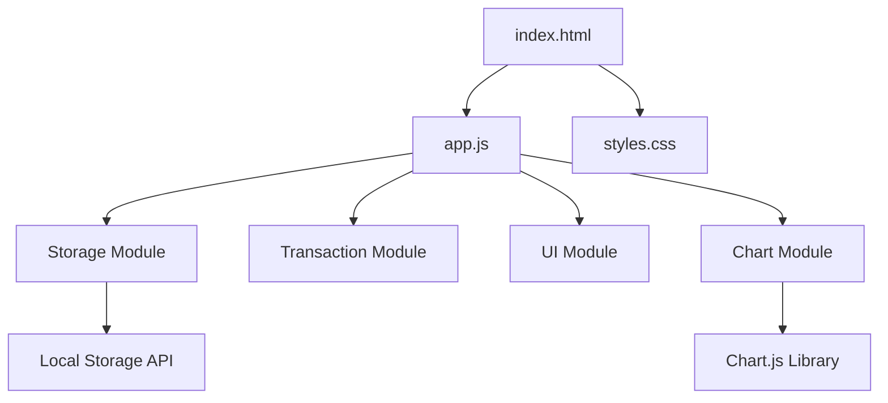

# Design Document: Expense & Budget Visualizer

## Overview

The Expense & Budget Visualizer is a client-side web application built with vanilla JavaScript, HTML, and CSS. The application provides a minimal interface for tracking expenses with automatic categorization and visualization. All data is persisted in browser Local Storage, eliminating the need for a backend server.

The architecture follows a simple MVC-inspired pattern where the DOM serves as the view, JavaScript modules handle business logic and state management, and Local Storage acts as the persistence layer. The application uses Chart.js for pie chart visualization of spending distribution across three fixed categories: Food, Transport, and Fun.

Key design principles:

- Single-page application with no page reloads
- Immediate UI updates on all state changes
- Automatic persistence on every transaction modification
- Minimal dependencies (Chart.js only)
- Progressive enhancement with graceful degradation

## Architecture

### High-Level Structure



### Module Breakdown

**Storage Module** (`storage.js` functionality within `app.js`)

- Handles all Local Storage interactions
- Provides CRUD operations for transactions
- Manages serialization/deserialization
- Handles storage availability checks

**Transaction Module** (`transaction.js` functionality within `app.js`)

- Defines transaction data structure
- Validates transaction input
- Calculates totals and category aggregations

**UI Module** (`ui.js` functionality within `app.js`)

- Manages DOM manipulation
- Handles form submission and validation
- Renders transaction list
- Updates balance display
- Manages user interactions

**Chart Module** (`chart.js` functionality within `app.js`)

- Initializes Chart.js instance
- Updates chart data on transaction changes
- Handles empty state visualization

Since the requirement specifies a single JavaScript file, all modules will be organized as separate sections within `js/app.js` with clear comments delineating boundaries.

## Components and Interfaces

### Transaction Object

```javascript
{
  id: string,          // Unique identifier (timestamp-based)
  itemName: string,    // Name of the expense item
  amount: number,      // Positive number representing cost
  category: string     // One of: "Food", "Transport", "Fun"
}
```

### Storage Interface

```javascript
// Load all transactions from Local Storage
function loadTransactions(): Transaction[]

// Save all transactions to Local Storage
function saveTransactions(transactions: Transaction[]): void

// Check if Local Storage is available
function isStorageAvailable(): boolean
```

### Transaction Interface

```javascript
// Create a new transaction with validation
function createTransaction(itemName: string, amount: number, category: string): Transaction | Error

// Calculate total balance from transactions
function calculateTotal(transactions: Transaction[]): number

// Calculate spending by category
function calculateCategoryTotals(transactions: Transaction[]): { [category: string]: number }

// Validate transaction input
function validateTransactionInput(itemName: string, amount: string, category: string): { valid: boolean, error?: string }
```

### UI Interface

```javascript
// Initialize the application
function init(): void

// Render the transaction list
function renderTransactions(transactions: Transaction[]): void

// Update the balance display
function updateBalance(total: number): void

// Handle form submission
function handleFormSubmit(event: Event): void

// Handle transaction deletion
function handleDelete(transactionId: string): void

// Display error message
function showError(message: string): void

// Clear form fields
function clearForm(): void
```

### Chart Interface

```javascript
// Initialize Chart.js pie chart
function initChart(): Chart

// Update chart with new data
function updateChart(categoryTotals: { [category: string]: number }): void
```

## Data Models

### Transaction Model

The core data structure representing a single expense:

```javascript
class Transaction {
  constructor(itemName, amount, category) {
    this.id = Date.now().toString() + Math.random().toString(36).substr(2, 9);
    this.itemName = itemName.trim();
    this.amount = parseFloat(amount);
    this.category = category;
  }
}
```

**Constraints:**

- `id`: Must be unique across all transactions
- `itemName`: Non-empty string after trimming whitespace
- `amount`: Positive number (> 0)
- `category`: Must be one of ["Food", "Transport", "Fun"]

### Application State

The application maintains a single source of truth in memory:

```javascript
let transactions = []; // Array of Transaction objects
let chartInstance = null; // Chart.js instance
```

State is synchronized with Local Storage on every modification.

### Storage Schema

Transactions are stored in Local Storage as a JSON array under the key `"transactions"`:

```json
[
  {
    "id": "1234567890abc",
    "itemName": "Lunch",
    "amount": 12.5,
    "category": "Food"
  },
  {
    "id": "0987654321xyz",
    "itemName": "Bus ticket",
    "amount": 2.75,
    "category": "Transport"
  }
]
```

### Category Configuration

Categories are hardcoded as a constant array:

```javascript
const CATEGORIES = ["Food", "Transport", "Fun"];
```

This ensures consistency across the application and simplifies validation.

### Chart Interface

```javascript
// Initialize Chart.js pie chart
function initChart(): Chart

// Update chart with new data
function updateChart(categoryTotals: { [category: string]: number }): void
```

### Event Flow

**Adding a Transaction:**

1. User fills form and submits
2. Validate input (all fields non-empty, amount positive)
3. Create transaction object with unique ID
4. Add to in-memory transactions array
5. Save to Local Storage
6. Update UI (list, balance, chart)
7. Clear form fields

**Deleting a Transaction:**

1. User clicks delete button
2. Remove transaction from in-memory array
3. Update Local Storage
4. Update UI (list, balance, chart)

**Application Initialization:**

1. Check Local Storage availability
2. Load transactions from Local Storage
3. Initialize Chart.js instance
4. Render initial UI state
5. Attach event listeners

## Correctness Properties

_A property is a characteristic or behavior that should hold true across all valid executions of a system—essentially, a formal statement about what the system should do. Properties serve as the bridge between human-readable specifications and machine-verifiable correctness guarantees._

### Property 1: Empty field validation

_For any_ form submission where at least one field (itemName, amount, or category) is empty or contains only whitespace, the application should reject the submission and display a validation error message without modifying the transaction list.

**Validates: Requirements 1.5**

### Property 2: Positive amount validation

_For any_ amount input that is not a positive number (including zero, negative numbers, and non-numeric strings), the application should reject the submission and display a validation error message.

**Validates: Requirements 1.6**

### Property 3: Form clearing after submission

_For any_ valid transaction submission, after the transaction is successfully added, all form fields (itemName, amount, category) should be cleared to their default empty state.

**Validates: Requirements 1.7**

### Property 4: Transaction addition to list

_For any_ valid transaction, when added to the application, the transaction should appear in the rendered transaction list immediately.

**Validates: Requirements 1.3, 2.3**

### Property 5: Transaction persistence round-trip

_For any_ valid transaction, after adding it to the application and reloading the page, the transaction should be loaded from Local Storage with all fields (itemName, amount, category) preserved exactly.

**Validates: Requirements 1.4, 6.2, 6.4**

### Property 6: Transaction display completeness

_For any_ transaction in the list, the rendered HTML should contain the transaction's itemName, amount, and category in a human-readable format.

**Validates: Requirements 2.2**

### Property 7: Transaction list ordering

_For any_ sequence of transaction additions, the displayed transaction list should maintain the order in which transactions were added (first added appears first).

**Validates: Requirements 2.5**

### Property 8: Delete button presence

_For any_ non-empty transaction list, each rendered transaction should have an associated delete button.

**Validates: Requirements 3.1**

### Property 9: Transaction deletion from list

_For any_ transaction in the list, clicking its delete button should remove that transaction from the displayed list immediately.

**Validates: Requirements 3.2, 2.4**

### Property 10: Transaction deletion from storage

_For any_ transaction, after deleting it from the application and reloading the page, the transaction should not be present in the loaded data.

**Validates: Requirements 3.3, 6.3**

### Property 11: Balance calculation correctness

_For any_ list of transactions, the displayed total balance should equal the sum of all transaction amounts.

**Validates: Requirements 4.2**

### Property 12: Balance update on addition

_For any_ valid transaction with amount A, adding it to a list with current balance B should result in a new balance of B + A.

**Validates: Requirements 4.3**

### Property 13: Balance update on deletion

_For any_ transaction with amount A, deleting it from a list with current balance B should result in a new balance of B - A.

**Validates: Requirements 3.4, 4.4**

### Property 14: Category totals calculation

_For any_ list of transactions, the sum of amounts for each category should equal the total of all transactions with that category label.

**Validates: Requirements 5.2**

### Property 15: Chart update on addition

_For any_ valid transaction with category C and amount A, after adding it, the chart should display a value for category C that includes the added amount A.

**Validates: Requirements 5.3**

### Property 16: Chart update on deletion

_For any_ transaction with category C and amount A, after deleting it, the chart should display a value for category C that excludes the deleted amount A.

**Validates: Requirements 3.5, 5.4**

### Property 17: Transaction loading on startup

_For any_ set of transactions stored in Local Storage, when the application initializes, all stored transactions should be loaded and displayed in the transaction list.

**Validates: Requirements 6.1**

## Error Handling

### Input Validation Errors

**Empty Fields:**

- Trigger: User submits form with any empty field
- Response: Display error message "All fields are required"
- State: Form remains populated with entered values
- Recovery: User fills missing fields and resubmits

**Invalid Amount:**

- Trigger: User enters non-numeric or non-positive amount
- Response: Display error message "Amount must be a positive number"
- State: Form remains populated with entered values
- Recovery: User corrects amount and resubmits

### Storage Errors

**Local Storage Unavailable:**

- Trigger: Local Storage API not available (private browsing, disabled)
- Response: Display prominent error message "Storage unavailable - data will not be saved"
- State: Application continues to function with in-memory state only
- Recovery: User enables Local Storage or uses different browser mode

**Storage Quota Exceeded:**

- Trigger: Local Storage quota exceeded when saving
- Response: Display error message "Storage full - unable to save transaction"
- State: Transaction not added, previous data preserved
- Recovery: User deletes old transactions to free space

**Corrupted Storage Data:**

- Trigger: Invalid JSON or malformed data in Local Storage
- Response: Log error to console, initialize with empty transaction list
- State: Start fresh with no transactions
- Recovery: Automatic - application continues with clean state

### Chart Errors

**Chart.js Load Failure:**

- Trigger: Chart.js library fails to load from CDN
- Response: Display message "Chart unavailable" in chart container
- State: Application continues functioning without chart
- Recovery: User refreshes page or checks internet connection

**Chart Rendering Error:**

- Trigger: Chart.js throws error during rendering
- Response: Log error to console, display fallback message
- State: Application continues functioning, chart shows error state
- Recovery: Automatic retry on next data update

### General Error Handling Strategy

- All errors should be caught and handled gracefully
- User-facing errors should be clear and actionable
- Technical errors should be logged to console for debugging
- Application should never crash or become unresponsive
- Partial functionality is preferred over complete failure

## Testing Strategy

### Overview

The testing strategy employs a dual approach combining unit tests for specific scenarios and property-based tests for universal correctness guarantees. This ensures both concrete examples work correctly and general properties hold across all possible inputs.

### Unit Testing

**Framework:** Jest or Vitest (for vanilla JavaScript)

**Focus Areas:**

- Specific examples demonstrating correct behavior
- Edge cases (empty lists, zero balance, single transaction)
- Error conditions (invalid inputs, storage failures)
- Integration between modules

**Example Unit Tests:**

- Adding a transaction with valid inputs creates correct object
- Deleting the last transaction results in empty list
- Balance displays zero when no transactions exist
- Error message appears when amount is negative
- Form clears after successful submission
- Chart shows placeholder when no data exists

**Coverage Goals:**

- All error handling paths
- Boundary conditions (empty, single item, many items)
- Integration points between storage and UI
- Category dropdown population

### Property-Based Testing

**Framework:** fast-check (JavaScript property-based testing library)

**Configuration:**

- Minimum 100 iterations per property test
- Each test tagged with feature name and property reference
- Tag format: `Feature: simple-web-app, Property {number}: {property_text}`

**Property Test Implementation:**

Each correctness property from the design document must be implemented as a property-based test:

1. **Property 1 (Empty field validation):** Generate random inputs with at least one empty field, verify rejection
2. **Property 2 (Positive amount validation):** Generate random invalid amounts, verify rejection
3. **Property 3 (Form clearing):** Generate random valid transactions, verify form clears after submission
4. **Property 4 (Transaction addition):** Generate random valid transactions, verify they appear in list
5. **Property 5 (Persistence round-trip):** Generate random transactions, add and reload, verify data preserved
6. **Property 6 (Display completeness):** Generate random transactions, verify all fields rendered
7. **Property 7 (List ordering):** Generate random transaction sequences, verify display order
8. **Property 8 (Delete button presence):** Generate random transaction lists, verify each has delete button
9. **Property 9 (Deletion from list):** Generate random transactions, add and delete, verify removal
10. **Property 10 (Deletion from storage):** Generate random transactions, delete and reload, verify removal
11. **Property 11 (Balance calculation):** Generate random transaction lists, verify sum correctness
12. **Property 12 (Balance on addition):** Generate random transactions, verify balance increases correctly
13. **Property 13 (Balance on deletion):** Generate random transactions, delete, verify balance decreases correctly
14. **Property 14 (Category totals):** Generate random transactions, verify category sums
15. **Property 15 (Chart on addition):** Generate random transactions, verify chart reflects addition
16. **Property 16 (Chart on deletion):** Generate random transactions, delete, verify chart reflects deletion
17. **Property 17 (Startup loading):** Generate random transaction sets, store and reload, verify loading

**Generators:**

- Valid transaction generator (random itemName, positive amount, valid category)
- Invalid amount generator (zero, negative, NaN, strings)
- Empty field generator (empty strings, whitespace-only strings)
- Transaction list generator (arrays of 0-100 transactions)

### Integration Testing

**Manual Testing Scenarios:**

- Complete user workflow: add multiple transactions, view chart, delete some, verify persistence
- Browser compatibility testing across Chrome, Firefox, Edge, Safari
- Storage quota testing with large transaction lists
- Offline functionality verification

### Test Organization

```
tests/
  unit/
    storage.test.js       # Storage module unit tests
    transaction.test.js   # Transaction validation and calculation tests
    ui.test.js           # UI rendering and interaction tests
  property/
    transaction.property.test.js  # Property-based tests for all properties
  integration/
    app.integration.test.js       # End-to-end workflow tests
```

### Testing Priorities

1. **Critical Path:** Transaction CRUD operations and persistence
2. **Data Integrity:** Balance and category calculations
3. **User Experience:** Form validation and error handling
4. **Edge Cases:** Empty states, storage failures, invalid inputs

---

## Implementation Notes

### Technology Stack

- **HTML5:** Semantic markup for structure
- **CSS3:** Flexbox/Grid for layout, responsive design
- **Vanilla JavaScript (ES6+):** No framework dependencies
- **Chart.js:** Pie chart visualization (CDN or npm)
- **Local Storage API:** Client-side persistence

### File Structure

```
simple-web-app/
  index.html           # Main HTML file
  css/
    styles.css         # All application styles
  js/
    app.js            # All application logic (modular sections)
```

### Development Approach

1. **Phase 1:** HTML structure and CSS styling
2. **Phase 2:** Storage module and transaction model
3. **Phase 3:** Form handling and validation
4. **Phase 4:** Transaction list rendering and deletion
5. **Phase 5:** Balance calculation and display
6. **Phase 6:** Chart.js integration
7. **Phase 7:** Testing and refinement

### Browser Compatibility Considerations

- Use `const`/`let` instead of `var` (ES6+)
- Use `addEventListener` for event handling
- Avoid experimental APIs
- Test Local Storage availability before use
- Provide fallbacks for Chart.js load failures

### Performance Considerations

- Minimize DOM manipulation (batch updates where possible)
- Use event delegation for delete buttons
- Debounce chart updates if needed
- Limit stored transactions to reasonable number (consider future pagination)

---

## Review Notes

This design document provides a comprehensive technical specification for implementing the Expense & Budget Visualizer MVP. The architecture is intentionally simple, using vanilla JavaScript organized into logical modules within a single file as required. The design emphasizes immediate UI updates, automatic persistence, and graceful error handling.

Key design decisions:

- Single JavaScript file with clear module boundaries via comments
- Timestamp-based IDs for transaction uniqueness
- Synchronous Local Storage operations (acceptable for MVP scale)
- Chart.js for visualization (mature, well-documented library)
- Progressive enhancement with error fallbacks

The correctness properties provide a comprehensive testing foundation, ensuring all functional requirements are validated through both property-based and unit testing approaches.
