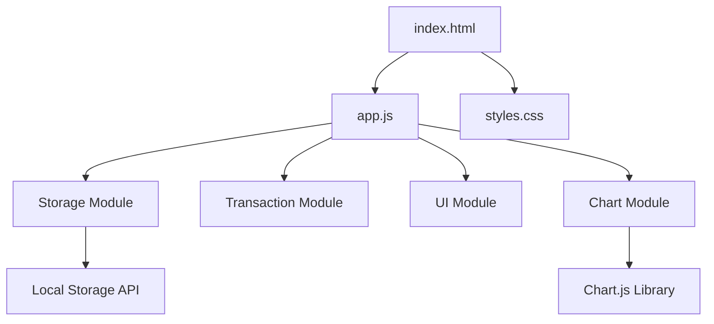

# Design Document: Expense & Budget Visualizer

## Overview

The Expense & Budget Visualizer is a client-side web application built with vanilla JavaScript, HTML, and CSS. The application provides a minimal interface for tracking expenses with automatic categorization and visualization. All data is persisted in browser Local Storage, eliminating the need for a backend server.

The architecture follows a simple MVC-inspired pattern where the DOM serves as the view, JavaScript modules handle business logic and state management, and Local Storage acts as the persistence layer. The application uses Chart.js for pie chart visualization of spending distribution across three fixed categories: Food, Transport, and Fun.

Key design principles:

- Single-page application with no page reloads
- Immediate UI updates on all state changes
- Automatic persistence on every transaction modification
- Minimal dependencies (Chart.js only)
- Progressive enhancement with graceful degradation

## Architecture

### High-Level Structure



### Module Breakdown

**Storage Module** (`storage.js` functionality within `app.js`)

- Handles all Local Storage interactions
- Provides CRUD operations for transactions
- Manages custom category persistence
- Stores and retrieves theme preferences
- Manages serialization/deserialization
- Handles storage availability checks

**Transaction Module** (`transaction.js` functionality within `app.js`)

- Defines transaction data structure
- Validates transaction input
- Calculates totals and category aggregations
- Handles transaction sorting (by amount, by category)

**Category Module** (`category.js` functionality within `app.js`)

- Manages default and custom categories
- Validates category names (uniqueness, non-empty)
- Handles custom category creation and deletion
- Manages transaction reassignment when categories are deleted
- Provides category list for dropdown population

**UI Module** (`ui.js` functionality within `app.js`)

- Manages DOM manipulation
- Handles form submission and validation
- Renders transaction list with current sort order
- Updates balance display
- Manages user interactions
- Renders category management interface
- Handles sort control interactions
- Manages theme toggle control

**Chart Module** (`chart.js` functionality within `app.js`)

- Initializes Chart.js instance
- Updates chart data on transaction changes
- Handles empty state visualization
- Adapts chart colors based on current theme

**Theme Module** (`theme.js` functionality within `app.js`)

- Manages dark/light mode state
- Applies theme-specific CSS classes
- Persists theme preference to Local Storage
- Loads theme preference on startup

Since the requirement specifies a single JavaScript file, all modules will be organized as separate sections within `js/app.js` with clear comments delineating boundaries.

## Components and Interfaces

### Transaction Object

```javascript
{
  id: string,          // Unique identifier (timestamp-based)
  itemName: string,    // Name of the expense item
  amount: number,      // Positive number representing cost
  category: string     // One of default categories or custom category name
}
```

### Storage Interface

```javascript
// Load all transactions from Local Storage
function loadTransactions(): Transaction[]

// Save all transactions to Local Storage
function saveTransactions(transactions: Transaction[]): void

// Load custom categories from Local Storage
function loadCustomCategories(): string[]

// Save custom categories to Local Storage
function saveCustomCategories(categories: string[]): void

// Load theme preference from Local Storage
function loadThemePreference(): string | null

// Save theme preference to Local Storage
function saveThemePreference(theme: string): void

// Check if Local Storage is available
function isStorageAvailable(): boolean
```

### Transaction Interface

```javascript
// Create a new transaction with validation
function createTransaction(itemName: string, amount: number, category: string): Transaction | Error

// Calculate total balance from transactions
function calculateTotal(transactions: Transaction[]): number

// Calculate spending by category
function calculateCategoryTotals(transactions: Transaction[]): { [category: string]: number }

// Validate transaction input
function validateTransactionInput(itemName: string, amount: string, category: string): { valid: boolean, error?: string }

// Sort transactions by amount (ascending or descending)
function sortByAmount(transactions: Transaction[], ascending: boolean): Transaction[]

// Sort transactions by category (alphabetically)
function sortByCategory(transactions: Transaction[]): Transaction[]

// Apply current sort order to transaction list
function applySortOrder(transactions: Transaction[], sortMode: string): Transaction[]
```

### Category Interface

```javascript
// Get all categories (default + custom)
function getAllCategories(): string[]

// Add a new custom category
function addCustomCategory(categoryName: string): { success: boolean, error?: string }

// Delete a custom category
function deleteCustomCategory(categoryName: string): { success: boolean, error?: string }

// Check if a category is a default category
function isDefaultCategory(categoryName: string): boolean

// Validate category name (non-empty, unique)
function validateCategoryName(categoryName: string): { valid: boolean, error?: string }

// Reassign transactions from deleted category
function reassignTransactions(transactions: Transaction[], deletedCategory: string, newCategory: string): Transaction[]
```

### UI Interface

```javascript
// Initialize the application
function init(): void

// Render the transaction list with current sort order
function renderTransactions(transactions: Transaction[]): void

// Update the balance display
function updateBalance(total: number): void

// Handle form submission
function handleFormSubmit(event: Event): void

// Handle transaction deletion
function handleDelete(transactionId: string): void

// Display error message
function showError(message: string): void

// Clear form fields
function clearForm(): void

// Render category management interface
function renderCategoryManagement(): void

// Handle custom category addition
function handleAddCategory(categoryName: string): void

// Handle custom category deletion
function handleDeleteCategory(categoryName: string): void

// Update category dropdown with all categories
function updateCategoryDropdown(): void

// Handle sort control change
function handleSortChange(sortMode: string): void

// Update sort indicator in UI
function updateSortIndicator(sortMode: string): void

// Handle theme toggle
function handleThemeToggle(): void

// Apply theme to UI elements
function applyTheme(theme: string): void
```

### Theme Interface

```javascript
// Get current theme
function getCurrentTheme(): string

// Set theme (dark or light)
function setTheme(theme: string): void

// Toggle between dark and light mode
function toggleTheme(): void

// Load theme preference on startup
function initializeTheme(): void
```

### Chart Interface

```javascript
// Initialize Chart.js pie chart
function initChart(): Chart

// Update chart with new data
function updateChart(categoryTotals: { [category: string]: number }): void

// Update chart colors based on current theme
function updateChartTheme(theme: string): void
```

## Data Models

### Transaction Model

The core data structure representing a single expense:

```javascript
class Transaction {
  constructor(itemName, amount, category) {
    this.id = Date.now().toString() + Math.random().toString(36).substr(2, 9);
    this.itemName = itemName.trim();
    this.amount = parseFloat(amount);
    this.category = category;
  }
}
```

**Constraints:**

- `id`: Must be unique across all transactions
- `itemName`: Non-empty string after trimming whitespace
- `amount`: Positive number (> 0)
- `category`: Must be one of default categories ["Food", "Transport", "Fun"] or a valid custom category

### Application State

The application maintains a single source of truth in memory:

```javascript
let transactions = []; // Array of Transaction objects
let customCategories = []; // Array of custom category names
let currentSortMode = "none"; // Current sort mode: 'none', 'amount-asc', 'amount-desc', 'category'
let currentTheme = "light"; // Current theme: 'light' or 'dark'
let chartInstance = null; // Chart.js instance
```

State is synchronized with Local Storage on every modification.

### Storage Schema

Transactions are stored in Local Storage as a JSON array under the key `"transactions"`:

```json
[
  {
    "id": "1234567890abc",
    "itemName": "Lunch",
    "amount": 12.5,
    "category": "Food"
  },
  {
    "id": "0987654321xyz",
    "itemName": "Bus ticket",
    "amount": 2.75,
    "category": "Transport"
  }
]
```

Custom categories are stored as a JSON array under the key `"customCategories"`:

```json
["Entertainment", "Healthcare", "Education"]
```

Theme preference is stored as a string under the key `"theme"`:

```json
"dark"
```

### Category Configuration

Default categories are hardcoded as a constant array:

```javascript
const DEFAULT_CATEGORIES = ["Food", "Transport", "Fun"];
```

Custom categories are loaded from Local Storage and combined with default categories for display. This ensures consistency while allowing user customization.

### Sort State

The application maintains the current sort mode and applies it consistently:

```javascript
const SORT_MODES = {
  NONE: "none",
  AMOUNT_ASC: "amount-asc",
  AMOUNT_DESC: "amount-desc",
  CATEGORY: "category",
};
```

When a new transaction is added, it's inserted according to the current sort mode to maintain order.

### Theme State

The application supports two themes with corresponding CSS classes:

```javascript
const THEMES = {
  LIGHT: "light",
  DARK: "dark",
};
```

Theme is applied by adding/removing a class on the document body element, triggering CSS variable changes for colors throughout the application.

### Chart Interface

```javascript
// Initialize Chart.js pie chart
function initChart(): Chart

// Update chart with new data
function updateChart(categoryTotals: { [category: string]: number }): void
```

### Event Flow

**Adding a Transaction:**

1. User fills form and submits
2. Validate input (all fields non-empty, amount positive, category valid)
3. Create transaction object with unique ID
4. Add to in-memory transactions array
5. Apply current sort order to maintain list ordering
6. Save to Local Storage
7. Update UI (list, balance, chart)
8. Clear form fields

**Deleting a Transaction:**

1. User clicks delete button
2. Remove transaction from in-memory array
3. Update Local Storage
4. Update UI (list, balance, chart)

**Adding a Custom Category:**

1. User enters category name in management interface
2. Validate category name (non-empty, unique)
3. Add to in-memory customCategories array
4. Save to Local Storage
5. Update category dropdown
6. Clear category input field

**Deleting a Custom Category:**

1. User clicks delete button on custom category
2. Check if category is default (prevent deletion if so)
3. Check for transactions using this category
4. If transactions exist, prompt user to select reassignment category
5. Reassign transactions to selected category
6. Remove category from in-memory array
7. Update Local Storage (categories and transactions)
8. Update UI (dropdown, transaction list, chart)

**Sorting Transactions:**

1. User selects sort mode from control
2. Update currentSortMode state
3. Apply sort to transactions array
4. Re-render transaction list
5. Update sort indicator in UI

**Toggling Theme:**

1. User clicks theme toggle button
2. Determine new theme (opposite of current)
3. Update currentTheme state
4. Apply theme CSS class to body
5. Update chart colors if needed
6. Save theme preference to Local Storage

**Application Initialization:**

1. Check Local Storage availability
2. Load transactions from Local Storage
3. Load custom categories from Local Storage
4. Load theme preference from Local Storage (default to light if none)
5. Apply theme to UI
6. Initialize Chart.js instance with theme colors
7. Render initial UI state (transactions, balance, chart, categories)
8. Attach event listeners

## Correctness Properties

_A property is a characteristic or behavior that should hold true across all valid executions of a system—essentially, a formal statement about what the system should do. Properties serve as the bridge between human-readable specifications and machine-verifiable correctness guarantees._

### Property 1: Empty field validation

_For any_ form submission where at least one field (itemName, amount, or category) is empty or contains only whitespace, the application should reject the submission and display a validation error message without modifying the transaction list.

**Validates: Requirements 1.5**

### Property 2: Positive amount validation

_For any_ amount input that is not a positive number (including zero, negative numbers, and non-numeric strings), the application should reject the submission and display a validation error message.

**Validates: Requirements 1.6**

### Property 3: Form clearing after submission

_For any_ valid transaction submission, after the transaction is successfully added, all form fields (itemName, amount, category) should be cleared to their default empty state.

**Validates: Requirements 1.7**

### Property 4: Transaction addition to list

_For any_ valid transaction, when added to the application, the transaction should appear in the rendered transaction list immediately.

**Validates: Requirements 1.3, 2.3**

### Property 5: Transaction persistence round-trip

_For any_ valid transaction, after adding it to the application and reloading the page, the transaction should be loaded from Local Storage with all fields (itemName, amount, category) preserved exactly.

**Validates: Requirements 1.4, 6.2, 6.4**

### Property 6: Transaction display completeness

_For any_ transaction in the list, the rendered HTML should contain the transaction's itemName, amount, and category in a human-readable format.

**Validates: Requirements 2.2**

### Property 7: Transaction list ordering

_For any_ sequence of transaction additions, the displayed transaction list should maintain the order in which transactions were added (first added appears first).

**Validates: Requirements 2.5**

### Property 8: Delete button presence

_For any_ non-empty transaction list, each rendered transaction should have an associated delete button.

**Validates: Requirements 3.1**

### Property 9: Transaction deletion from list

_For any_ transaction in the list, clicking its delete button should remove that transaction from the displayed list immediately.

**Validates: Requirements 3.2, 2.4**

### Property 10: Transaction deletion from storage

_For any_ transaction, after deleting it from the application and reloading the page, the transaction should not be present in the loaded data.

**Validates: Requirements 3.3, 6.3**

### Property 11: Balance calculation correctness

_For any_ list of transactions, the displayed total balance should equal the sum of all transaction amounts.

**Validates: Requirements 4.2**

### Property 12: Balance update on addition

_For any_ valid transaction with amount A, adding it to a list with current balance B should result in a new balance of B + A.

**Validates: Requirements 4.3**

### Property 13: Balance update on deletion

_For any_ transaction with amount A, deleting it from a list with current balance B should result in a new balance of B - A.

**Validates: Requirements 3.4, 4.4**

### Property 14: Category totals calculation

_For any_ list of transactions, the sum of amounts for each category should equal the total of all transactions with that category label.

**Validates: Requirements 5.2**

### Property 15: Chart update on addition

_For any_ valid transaction with category C and amount A, after adding it, the chart should display a value for category C that includes the added amount A.

**Validates: Requirements 5.3**

### Property 16: Chart update on deletion

_For any_ transaction with category C and amount A, after deleting it, the chart should display a value for category C that excludes the deleted amount A.

**Validates: Requirements 3.5, 5.4**

### Property 17: Transaction loading on startup

_For any_ set of transactions stored in Local Storage, when the application initializes, all stored transactions should be loaded and displayed in the transaction list.

**Validates: Requirements 6.1**

### Property 18: Custom category addition

_For any_ valid category name (non-empty, unique), adding it as a custom category should result in that category appearing in the category dropdown.

**Validates: Requirements 9.1, 9.3**

### Property 19: Custom category persistence round-trip

_For any_ custom category, after adding it to the application and reloading the page, the category should be loaded from Local Storage and appear in the category dropdown.

**Validates: Requirements 9.2**

### Property 20: Custom category deletion from storage

_For any_ custom category, after deleting it from the application and reloading the page, the category should not be present in the loaded category list.

**Validates: Requirements 9.5**

### Property 21: Default category deletion prevention

_For any_ default category (Food, Transport, Fun), attempting to delete it should be rejected and the category should remain in the category list.

**Validates: Requirements 9.6**

### Property 22: Duplicate category name rejection

_For any_ existing category name (default or custom), attempting to create a new category with that exact name should be rejected with an error message.

**Validates: Requirements 9.7**

### Property 23: Transaction reassignment on category deletion

_For any_ custom category with associated transactions, deleting that category should result in all those transactions being reassigned to a valid category (either user-selected or default).

**Validates: Requirements 9.8**

### Property 24: Sort by amount ascending order

_For any_ list of transactions, when sorted by amount ascending, each transaction's amount should be less than or equal to the next transaction's amount.

**Validates: Requirements 10.2**

### Property 25: Sort by amount descending order

_For any_ list of transactions, when sorted by amount descending, each transaction's amount should be greater than or equal to the next transaction's amount.

**Validates: Requirements 10.3**

### Property 26: Sort by category alphabetical order

_For any_ list of transactions, when sorted by category, the categories should appear in alphabetical order (comparing adjacent transactions).

**Validates: Requirements 10.4**

### Property 27: Sort order maintenance on addition

_For any_ sorted transaction list with a given sort mode, adding a new transaction should result in the list maintaining the sort order (new transaction inserted in correct position).

**Validates: Requirements 10.6**

### Property 28: Sort indicator visibility

_For any_ active sort mode (not 'none'), the rendered UI should contain a visual indicator showing which sort mode is currently active.

**Validates: Requirements 10.7**

### Property 29: Theme application

_For any_ theme (dark or light), activating that theme should apply the corresponding CSS class or attribute to the document body element.

**Validates: Requirements 11.2, 11.3**

### Property 30: Theme preference persistence round-trip

_For any_ theme preference (dark or light), after setting it and reloading the application, the same theme should be applied on startup.

**Validates: Requirements 11.4, 11.5**

## Error Handling

### Input Validation Errors

**Empty Fields:**

- Trigger: User submits form with any empty field
- Response: Display error message "All fields are required"
- State: Form remains populated with entered values
- Recovery: User fills missing fields and resubmits

**Invalid Amount:**

- Trigger: User enters non-numeric or non-positive amount
- Response: Display error message "Amount must be a positive number"
- State: Form remains populated with entered values
- Recovery: User corrects amount and resubmits

**Invalid Category:**

- Trigger: User selects a category that no longer exists (edge case after deletion)
- Response: Display error message "Selected category is invalid"
- State: Form remains populated, category reset to first valid option
- Recovery: User selects valid category and resubmits

### Category Management Errors

**Duplicate Category Name:**

- Trigger: User attempts to create a category with a name that already exists
- Response: Display error message "Category already exists"
- State: Category input remains populated
- Recovery: User enters a different name

**Empty Category Name:**

- Trigger: User attempts to create a category with empty or whitespace-only name
- Response: Display error message "Category name cannot be empty"
- State: Category input cleared
- Recovery: User enters valid name

**Default Category Deletion Attempt:**

- Trigger: User attempts to delete a default category (Food, Transport, Fun)
- Response: Display error message "Cannot delete default categories"
- State: Category remains in list
- Recovery: None needed, operation prevented

**Category Deletion with Transactions:**

- Trigger: User attempts to delete a custom category that has associated transactions
- Response: Display prompt asking user to select reassignment category
- State: Deletion paused pending user selection
- Recovery: User selects target category, transactions reassigned, then category deleted

### Sorting Errors

**Invalid Sort Mode:**

- Trigger: Sort mode state becomes corrupted or invalid
- Response: Reset to 'none' sort mode, log error to console
- State: Transactions displayed in original order
- Recovery: Automatic - user can reselect sort mode

### Theme Errors

**Theme Preference Load Failure:**

- Trigger: Corrupted theme data in Local Storage
- Response: Default to light mode, log error to console
- State: Light theme applied
- Recovery: Automatic - user can toggle theme to set preference

### Storage Errors

**Local Storage Unavailable:**

- Trigger: Local Storage API not available (private browsing, disabled)
- Response: Display prominent error message "Storage unavailable - data will not be saved"
- State: Application continues to function with in-memory state only
- Recovery: User enables Local Storage or uses different browser mode

**Storage Quota Exceeded:**

- Trigger: Local Storage quota exceeded when saving
- Response: Display error message "Storage full - unable to save transaction"
- State: Transaction not added, previous data preserved
- Recovery: User deletes old transactions to free space

**Corrupted Storage Data:**

- Trigger: Invalid JSON or malformed data in Local Storage
- Response: Log error to console, initialize with empty transaction list
- State: Start fresh with no transactions
- Recovery: Automatic - application continues with clean state

### Chart Errors

**Chart.js Load Failure:**

- Trigger: Chart.js library fails to load from CDN
- Response: Display message "Chart unavailable" in chart container
- State: Application continues functioning without chart
- Recovery: User refreshes page or checks internet connection

**Chart Rendering Error:**

- Trigger: Chart.js throws error during rendering
- Response: Log error to console, display fallback message
- State: Application continues functioning, chart shows error state
- Recovery: Automatic retry on next data update

### General Error Handling Strategy

- All errors should be caught and handled gracefully
- User-facing errors should be clear and actionable
- Technical errors should be logged to console for debugging
- Application should never crash or become unresponsive
- Partial functionality is preferred over complete failure

## Testing Strategy

### Overview

The testing strategy employs a dual approach combining unit tests for specific scenarios and property-based tests for universal correctness guarantees. This ensures both concrete examples work correctly and general properties hold across all possible inputs.

### Unit Testing

**Framework:** Jest or Vitest (for vanilla JavaScript)

**Focus Areas:**

- Specific examples demonstrating correct behavior
- Edge cases (empty lists, zero balance, single transaction)
- Error conditions (invalid inputs, storage failures)
- Integration between modules

**Example Unit Tests:**

- Adding a transaction with valid inputs creates correct object
- Deleting the last transaction results in empty list
- Balance displays zero when no transactions exist
- Error message appears when amount is negative
- Form clears after successful submission
- Chart shows placeholder when no data exists
- Adding a custom category updates dropdown
- Deleting a custom category with transactions prompts for reassignment
- Default categories cannot be deleted
- Duplicate category names are rejected
- Sorting by amount ascending produces correct order
- Sorting by category produces alphabetical order
- Adding transaction to sorted list maintains order
- Theme toggle switches between dark and light mode
- Theme preference persists across page reloads
- Default theme is light when no preference exists

**Coverage Goals:**

- All error handling paths
- Boundary conditions (empty, single item, many items)
- Integration points between storage and UI
- Category dropdown population with default and custom categories
- Sort mode transitions and edge cases
- Theme switching and persistence
- Transaction reassignment logic when categories are deleted

### Property-Based Testing

**Framework:** fast-check (JavaScript property-based testing library)

**Configuration:**

- Minimum 100 iterations per property test
- Each test tagged with feature name and property reference
- Tag format: `Feature: simple-web-app, Property {number}: {property_text}`

**Property Test Implementation:**

Each correctness property from the design document must be implemented as a property-based test:

1. **Property 1 (Empty field validation):** Generate random inputs with at least one empty field, verify rejection
2. **Property 2 (Positive amount validation):** Generate random invalid amounts, verify rejection
3. **Property 3 (Form clearing):** Generate random valid transactions, verify form clears after submission
4. **Property 4 (Transaction addition):** Generate random valid transactions, verify they appear in list
5. **Property 5 (Persistence round-trip):** Generate random transactions, add and reload, verify data preserved
6. **Property 6 (Display completeness):** Generate random transactions, verify all fields rendered
7. **Property 7 (List ordering):** Generate random transaction sequences, verify display order
8. **Property 8 (Delete button presence):** Generate random transaction lists, verify each has delete button
9. **Property 9 (Deletion from list):** Generate random transactions, add and delete, verify removal
10. **Property 10 (Deletion from storage):** Generate random transactions, delete and reload, verify removal
11. **Property 11 (Balance calculation):** Generate random transaction lists, verify sum correctness
12. **Property 12 (Balance on addition):** Generate random transactions, verify balance increases correctly
13. **Property 13 (Balance on deletion):** Generate random transactions, delete, verify balance decreases correctly
14. **Property 14 (Category totals):** Generate random transactions, verify category sums
15. **Property 15 (Chart on addition):** Generate random transactions, verify chart reflects addition
16. **Property 16 (Chart on deletion):** Generate random transactions, delete, verify chart reflects deletion
17. **Property 17 (Startup loading):** Generate random transaction sets, store and reload, verify loading
18. **Property 18 (Custom category addition):** Generate random valid category names, add, verify in dropdown
19. **Property 19 (Custom category persistence):** Generate random custom categories, add and reload, verify persistence
20. **Property 20 (Custom category deletion from storage):** Generate random custom categories, delete and reload, verify removal
21. **Property 21 (Default category deletion prevention):** For each default category, attempt deletion, verify rejection
22. **Property 22 (Duplicate category rejection):** Generate random existing category names, attempt duplicate creation, verify rejection
23. **Property 23 (Transaction reassignment):** Generate random transactions with custom category, delete category, verify reassignment
24. **Property 24 (Sort by amount ascending):** Generate random transaction lists, sort ascending, verify order
25. **Property 25 (Sort by amount descending):** Generate random transaction lists, sort descending, verify order
26. **Property 26 (Sort by category):** Generate random transaction lists, sort by category, verify alphabetical order
27. **Property 27 (Sort order maintenance):** Generate random sorted lists, add transaction, verify order maintained
28. **Property 28 (Sort indicator visibility):** For each sort mode, verify visual indicator present in rendered HTML
29. **Property 29 (Theme application):** For each theme, activate it, verify CSS class applied to body
30. **Property 30 (Theme persistence):** Generate random theme preferences, set and reload, verify persistence

**Generators:**

- Valid transaction generator (random itemName, positive amount, valid category)
- Invalid amount generator (zero, negative, NaN, strings)
- Empty field generator (empty strings, whitespace-only strings)
- Transaction list generator (arrays of 0-100 transactions)
- Valid category name generator (random non-empty strings)
- Invalid category name generator (empty, whitespace-only, duplicates)
- Custom category list generator (arrays of 0-20 custom categories)
- Sort mode generator (all valid sort modes)
- Theme generator (dark, light)

### Integration Testing

**Manual Testing Scenarios:**

- Complete user workflow: add multiple transactions, view chart, delete some, verify persistence
- Custom category workflow: create categories, use in transactions, delete category with reassignment
- Sorting workflow: add transactions, try all sort modes, add new transaction to sorted list
- Theme workflow: toggle between dark and light mode, verify persistence across reload
- Browser compatibility testing across Chrome, Firefox, Edge, Safari
- Storage quota testing with large transaction lists
- Offline functionality verification

### Test Organization

```
tests/
  unit/
    storage.test.js       # Storage module unit tests
    transaction.test.js   # Transaction validation and calculation tests
    ui.test.js           # UI rendering and interaction tests
  property/
    transaction.property.test.js  # Property-based tests for all properties
  integration/
    app.integration.test.js       # End-to-end workflow tests
```

### Testing Priorities

1. **Critical Path:** Transaction CRUD operations and persistence, custom category management
2. **Data Integrity:** Balance and category calculations, transaction reassignment
3. **User Experience:** Form validation, error handling, sort order maintenance, theme switching
4. **Edge Cases:** Empty states, storage failures, invalid inputs, category deletion with transactions

---

## Implementation Notes

### Technology Stack

- **HTML5:** Semantic markup for structure
- **CSS3:** Flexbox/Grid for layout, responsive design
- **Vanilla JavaScript (ES6+):** No framework dependencies
- **Chart.js:** Pie chart visualization (CDN or npm)
- **Local Storage API:** Client-side persistence

### File Structure

```
simple-web-app/
  index.html           # Main HTML file
  css/
    styles.css         # All application styles (including theme variables)
  js/
    app.js            # All application logic (modular sections)
```

### Development Approach

1. **Phase 1:** HTML structure and CSS styling (including theme CSS variables)
2. **Phase 2:** Storage module and transaction model
3. **Phase 3:** Form handling and validation
4. **Phase 4:** Transaction list rendering and deletion
5. **Phase 5:** Balance calculation and display
6. **Phase 6:** Chart.js integration
7. **Phase 7:** Custom category management
8. **Phase 8:** Transaction sorting functionality
9. **Phase 9:** Dark/light mode toggle
10. **Phase 10:** Testing and refinement

### Browser Compatibility Considerations

- Use `const`/`let` instead of `var` (ES6+)
- Use `addEventListener` for event handling
- Avoid experimental APIs
- Test Local Storage availability before use
- Provide fallbacks for Chart.js load failures

### Performance Considerations

- Minimize DOM manipulation (batch updates where possible)
- Use event delegation for delete buttons
- Debounce chart updates if needed
- Limit stored transactions to reasonable number (consider future pagination)
- Cache sorted transaction arrays to avoid re-sorting on every render
- Use CSS transitions for smooth theme switching
- Optimize category dropdown updates (only re-render when categories change)

---

## Review Notes

This design document provides a comprehensive technical specification for implementing the Expense & Budget Visualizer with enhanced features. The architecture is intentionally simple, using vanilla JavaScript organized into logical modules within a single file as required. The design emphasizes immediate UI updates, automatic persistence, and graceful error handling.

Key design decisions:

- Single JavaScript file with clear module boundaries via comments
- Timestamp-based IDs for transaction uniqueness
- Synchronous Local Storage operations (acceptable for MVP scale)
- Chart.js for visualization (mature, well-documented library)
- Progressive enhancement with error fallbacks
- Custom category system with default category protection
- Flexible sorting with maintained order on new additions
- Theme system using CSS variables and body class toggling
- Transaction reassignment workflow for category deletion

The correctness properties provide a comprehensive testing foundation, ensuring all functional requirements (including the three new features) are validated through both property-based and unit testing approaches. The design maintains simplicity while adding significant user customization capabilities.
